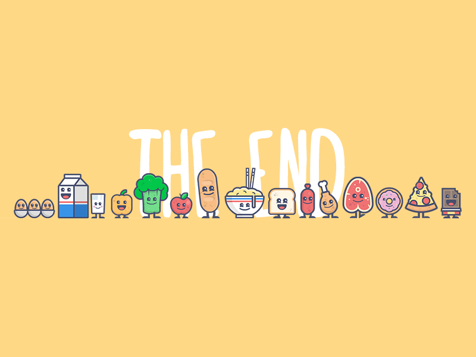

<body>
<h1 align="center"> ⬇️ 𝙒𝙚𝙡𝙘𝙤𝙢𝙚 𝙩𝙤 𝙢𝙮 𝙥𝙧𝙤𝙛𝙞𝙡𝙚 ⬇️ </h1>
 

 

<h2 align="center"> 💬 𝘼𝙗𝙤𝙪𝙩 𝙢𝙚 🗨️ </h2>

<li><b>Name:</b> Gagana Yushan</li>
<li><b>University:</b> SLIIT (Sri Lanka Institute of Information Technology)</li>
<li><b>Interests:</b> UI/UX Designing, Business Analysis, Project Management, AI Development, Product Thinking</li>
<li><b>Focus:</b> Bridging Technology, Business & Design</li>

 

<b>
I’m passionate about building meaningful digital products that combine 
clean design, smart business strategy, and strong technical foundations. 🚀
</b>

<h2 align="left"> 📇 𝙆𝙣𝙤𝙬𝙡𝙚𝙙𝙜𝙚 / 𝙎𝙠𝙞𝙡𝙡𝙨 📇</h2>

 
 
 
 
 
 
 
  

<b>Core Areas:</b> 
• UI/UX Design Principles 
• Business Analysis & Requirement Gathering 
• Agile & Project Management Basics 
• Full-Stack Web Development 
• AI-based Application Development

 

<h2 align="center">⌨️ 𝙇𝙚𝙖𝙙𝙚𝙧𝙨𝙝𝙞𝙥 & 𝙀𝙭𝙥𝙚𝙧𝙞𝙚𝙣𝙘𝙚 🖱️</h2>

  

🎯 Active member of <b>AIESEC</b> at SLIIT  
Contributed to leadership, creative initiatives, and organizational growth.  

💻 Worked on multiple academic and personal projects involving: 
Full-Stack Development, UI/UX Improvements, AI Interview Coach, and Smart Resume Analyzer concepts.  

I aim to grow into a strong Product-Oriented Tech Leader.

 

<h2 align="center">📝 𝘾𝙤𝙣𝙩𝙖𝙘𝙩 𝙢𝙚 📝</h2>

&nbsp;&nbsp;<b>Let’s connect and build something impactful 🚀</b>  

&nbsp;&nbsp;➡️ LinkedIn : <a href="https://www.linkedin.com/in/gagana-yushan-9025982aa/" target="_blank"> Gagana Yushan </a> 

&nbsp;&nbsp;📧 Email: gaganaushan16@gmail.com 

&nbsp;&nbsp;🌐 GitHub: https://github.com/GaganaUshan

 

<h2 align="center">💖 𝙏𝙝𝙖𝙣𝙠𝙨 𝙛𝙤𝙧 𝙫𝙞𝙨𝙞𝙩𝙞𝙣𝙜 𝙢𝙮 𝙥𝙧𝙤𝙛𝙞𝙡𝙚! 💖</h2>

</body>
